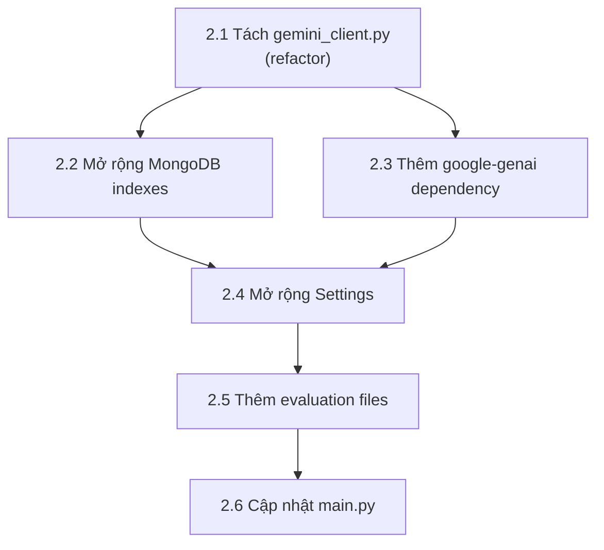

# Kế hoạch chỉnh sửa: CV Module (chuẩn bị merge)

## 1. Tổng quan

Sau khi phân tích cv-module, nhận thấy **6 thay đổi cần thiết** để chuẩn bị merge evaluation-module vào:

| # | Loại | Mức độ | Mô tả |
|---|------|--------|-------|
| 1 | Refactor | 🔴 Quan trọng | Tách `_call_gemini()` và `_extract_json()` thành shared utility |
| 2 | Mở rộng | 🟡 Cần thiết | Thêm indexes cho collection `evaluations` trong `mongodb.py` |
| 3 | Mở rộng | 🟡 Cần thiết | Thêm `google-genai` vào `requirements.txt` |
| 4 | Mở rộng | 🟡 Cần thiết | Thêm evaluation settings vào `core/config.py` |
| 5 | Thêm mới | 🟢 Khi merge | Thêm files: models, repo, service, prompt, route cho evaluation |
| 6 | Mở rộng | 🟢 Khi merge | Cập nhật `main.py` để include evaluation router |

---

## 2. Chi tiết từng thay đổi

### 2.1 🔴 Refactor: Tách shared utilities

**Vấn đề:** Cả `analyzer.py` và `question_gen.py` đều có 2 hàm **duplicate gần như hoàn toàn**:
- `_extract_json(text)` — parse JSON từ response Gemini
- `_call_gemini(system_prompt, user_prompt, timeout_seconds)` — gọi Gemini REST API

Khi thêm `evaluator.py`, sẽ có **3 bản copy** của cùng logic này.

**Giải pháp:** Tạo file `backend/services/gemini_client.py`:

```python
# backend/services/gemini_client.py
"""Shared Gemini API client — dùng chung cho analyzer, question_gen, evaluator."""

import json
from typing import Any

import httpx
from core.config import get_settings


class GeminiClientError(Exception):
    pass


def extract_json(text: str) -> dict[str, Any]:
    """Trích xuất JSON object từ response text của Gemini."""
    stripped = text.strip()
    if stripped.startswith("```"):
        stripped = stripped.strip("`")
        if stripped.startswith("json"):
            stripped = stripped[4:].strip()
    start = stripped.find("{")
    end = stripped.rfind("}")
    if start == -1 or end == -1:
        raise ValueError("No JSON object found")
    return json.loads(stripped[start : end + 1])


async def call_gemini(
    system_prompt: str,
    user_prompt: str,
    timeout_seconds: int = 30,
) -> str:
    """Gọi Gemini generateContent API, trả về response text."""
    settings = get_settings()
    endpoint = (
        f"https://generativelanguage.googleapis.com/v1beta/models/"
        f"{settings.gemini_model}:generateContent?key={settings.gemini_api_key}"
    )
    payload = {
        "system_instruction": {"parts": [{"text": system_prompt}]},
        "contents": [{"role": "user", "parts": [{"text": user_prompt}]}],
        "generationConfig": {
            "temperature": 0,
            "responseMimeType": "text/plain",
        },
    }
    async with httpx.AsyncClient(timeout=timeout_seconds) as client:
        response = await client.post(endpoint, json=payload)
        response.raise_for_status()
    data = response.json()
    candidates = data.get("candidates", [])
    if not candidates:
        raise GeminiClientError("Gemini returned no candidates")
    parts = candidates[0].get("content", {}).get("parts", [])
    text = "".join(part.get("text", "") for part in parts if isinstance(part, dict)).strip()
    if not text:
        raise GeminiClientError("Gemini returned empty content")
    return text
```

**Sau đó cập nhật:**

```diff
# analyzer.py
-from prompts.cv_analysis import ...
+from services.gemini_client import call_gemini, extract_json, GeminiClientError
 
-def _extract_json(text): ...    # XÓA
-async def _call_gemini(...): ...  # XÓA

 class CVAnalyzerError(Exception): pass

 async def analyze_cv(...):
     ...
-    raw = await _call_gemini(...)
-    data = _extract_json(raw)
+    raw = await call_gemini(...)
+    data = extract_json(raw)
```

```diff
# question_gen.py — tương tự
-def _extract_json(text): ...    # XÓA
-async def _call_gemini(...): ...  # XÓA
+from services.gemini_client import call_gemini, extract_json, GeminiClientError
```

> **QUAN TRỌNG:** Đây là thay đổi **nên làm trước khi merge** để tránh có 3 bản copy duplicate code.

---

### 2.2 🟡 Mở rộng MongoDB indexes

**File:** `db/mongodb.py`

```diff
 async def _create_indexes(db: AsyncIOMotorDatabase) -> None:
     # Existing indexes...
     await db.cv_analyses.create_index(...)
     await db.interview_questions.create_index(...)
+
+    # Evaluation indexes
+    await db.evaluations.create_index([("session_id", ASCENDING)], unique=True)
+    await db.evaluations.create_index([("user_id", ASCENDING), ("created_at", DESCENDING)])
+    await db.evaluations.create_index([("interview_session_id", ASCENDING)])
+    await db.evaluations.create_index([("created_at", DESCENDING)])
```

---

### 2.3 🟡 Thêm dependency

**File:** `requirements.txt`

```diff
+google-genai>=1.0.0
```

> Evaluation-module dùng `google-genai` SDK (giống API gốc) cho structured output với `response_mime_type="application/json"`. Có thể chọn dùng httpx REST call thống nhất với analyzer/question_gen, nhưng SDK cho kết quả JSON ổn định hơn.

---

### 2.4 🟡 Mở rộng Settings

**File:** `core/config.py`

```diff
 class Settings(BaseSettings):
     ...
     task_ttl_seconds: int = Field(default=3600, alias="TASK_TTL_SECONDS")
+
+    # Evaluation
+    eval_gemini_model: str = Field(default="gemini-2.5-flash", alias="EVAL_GEMINI_MODEL")
+    eval_max_retries: int = Field(default=3, alias="EVAL_MAX_RETRIES")
+    eval_timeout_seconds: int = Field(default=30, alias="EVAL_TIMEOUT_SECONDS")
```

> `eval_gemini_model` riêng vì evaluation dùng `gemini-2.5-flash` (mạnh hơn) trong khi cv-module dùng `gemini-3.1-flash-lite-preview` (rẻ hơn).

---

### 2.5 🟢 Thêm files khi merge

Khi merge evaluation-module vào cv-module, thêm các files sau:

| File mới | Copy từ evaluation-module |
|----------|--------------------------|
| `backend/models/evaluation.py` | Pydantic schemas |
| `backend/db/repositories/evaluation_repo.py` | Repository class |
| `backend/services/evaluator.py` | Gemini evaluation logic |
| `backend/prompts/evaluation.py` | STAR system prompt |
| `backend/api/routes/evaluation.py` | FastAPI endpoints |

---

### 2.6 🟢 Cập nhật main.py khi merge

**File:** `main.py`

```diff
 from api.routes.cv import router as cv_router
 from api.routes.questions import router as questions_router
+from api.routes.evaluation import router as evaluation_router

 app = FastAPI(title="CV Module API", version="0.1.0", lifespan=lifespan)
 app.include_router(cv_router, prefix="/api")
 app.include_router(questions_router, prefix="/api")
+app.include_router(evaluation_router, prefix="/api")
```

---

## 3. Thứ tự thực hiện



> **CẢNH BÁO:** **Bước 2.1 (refactor) nên thực hiện ngay** dù chưa merge — để codebase cv-module sạch hơn và sẵn sàng cho việc thêm evaluator service. Các bước còn lại chỉ cần khi thực sự merge.
