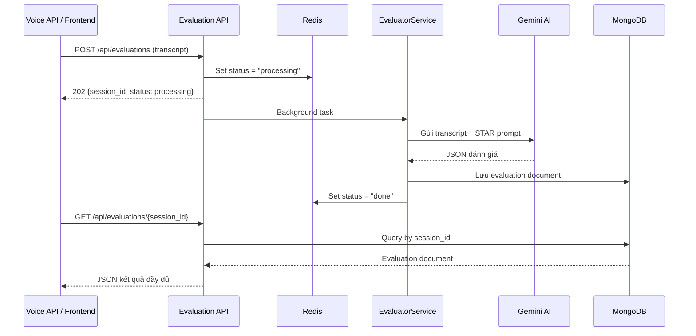

# Kế hoạch triển khai: Evaluation Module

## 1. Tổng quan

### 1.1 Mục tiêu
Xây dựng **evaluation-module** — backend service đánh giá buổi phỏng vấn sau khi kết thúc. Module này:
- Nhận transcript phỏng vấn (từ voice API hoặc REST call)
- Gọi Gemini AI đánh giá theo framework STAR
- **Lưu kết quả vào MongoDB** (theo pattern của cv-module)
- Expose REST API để frontend truy vấn kết quả

### 1.2 Hiện trạng

| Component | Trạng thái | Ghi chú |
|-----------|-----------|---------|
| evaluation.py (API gốc) | ✅ Hoạt động | FastAPI + Gemini, **không có DB**, trả JSON trực tiếp |
| voice.py (API gốc) | ✅ Hoạt động | WebSocket, gọi evaluation API qua HTTP nội bộ |
| cv-module/backend | ✅ Hoạt động | MongoDB + Redis + Repository pattern — **mẫu tham chiếu** |
| evaluation-module | 📝 Chỉ có docs + README | Chưa có code backend |

### 1.3 Nguyên tắc thiết kế
1. **Cùng DB, cùng pattern** với cv-module — dùng chung MongoDB Atlas instance (`cv_interview_app`)
2. **Tách biệt module** — evaluation-module là service độc lập, có thể chạy riêng hoặc merge vào cv-module sau
3. **Tương thích merge** — cấu trúc thư mục, naming convention, config pattern giống hệt cv-module

---

## 2. Kiến trúc đề xuất

### 2.1 Cấu trúc thư mục

```text
evaluation-module/
├── backend/
│   ├── api/
│   │   ├── __init__.py
│   │   └── routes/
│   │       ├── __init__.py
│   │       └── evaluation.py          # REST endpoints
│   ├── core/
│   │   ├── __init__.py
│   │   ├── config.py                  # Settings (pydantic-settings)
│   │   └── exceptions.py              # Custom HTTP exceptions
│   ├── db/
│   │   ├── __init__.py
│   │   ├── mongodb.py                 # Kết nối MongoDB (copy từ cv-module)
│   │   └── repositories/
│   │       ├── __init__.py
│   │       └── evaluation_repo.py     # Repository cho evaluations
│   ├── models/
│   │   ├── __init__.py
│   │   └── evaluation.py              # Pydantic schemas
│   ├── prompts/
│   │   ├── __init__.py
│   │   └── evaluation.py              # System prompt STAR
│   ├── services/
│   │   ├── __init__.py
│   │   └── evaluator.py               # Gọi Gemini + xử lý kết quả
│   ├── main.py                        # FastAPI entry point
│   ├── requirements.txt
│   ├── Dockerfile
│   ├── .env
│   └── .env.example
├── docker-compose.yml
├── docs/                              # (giữ nguyên docs hiện tại)
├── README.md
├── LICENSE
└── .gitignore
```

### 2.2 Luồng xử lý



---

## 3. Data Models (Pydantic)

### 3.1 File: `backend/models/evaluation.py`

```python
from datetime import datetime
from typing import Literal
from pydantic import BaseModel, ConfigDict, Field


# --- Request models ---

class TranscriptEntry(BaseModel):
    """Một lượt nói trong buổi phỏng vấn."""
    role: Literal["user", "model"]
    text: str


class EvaluationRequest(BaseModel):
    """Request body cho POST /api/evaluations."""
    interview: list[TranscriptEntry]
    session_id: str | None = None        # Nếu None → tự sinh UUID
    user_id: str | None = None
    interview_session_id: str | None = None  # Liên kết với session phỏng vấn gốc


# --- AI output models (Gemini trả về) ---

class STARScores(BaseModel):
    situation: int = Field(ge=0, le=10)
    task: int = Field(ge=0, le=10)
    action: int = Field(ge=0, le=10)
    result: int = Field(ge=0, le=10)


class QuestionEvaluation(BaseModel):
    question_index: int
    question_text: str = ""              # Câu hỏi gốc (trích từ transcript)
    answer_text: str = ""                # Câu trả lời gốc (trích từ transcript)
    star_scores: STARScores
    question_score: float = Field(ge=0, le=10)
    comment: str


class OverallEvaluation(BaseModel):
    overall_score: float = Field(ge=0, le=10)
    strengths: list[str] = Field(default_factory=list)
    key_improvements: list[str] = Field(default_factory=list)
    overall_comment: str


class EvaluationPayload(BaseModel):
    """Kết quả đánh giá từ Gemini — validate trước khi lưu DB."""
    questions: list[QuestionEvaluation] = Field(default_factory=list)
    overall: OverallEvaluation


# --- MongoDB document model ---

class EvaluationDocument(EvaluationPayload):
    model_config = ConfigDict(populate_by_name=True)

    id: str = Field(alias="_id")
    session_id: str
    user_id: str | None = None
    interview_session_id: str | None = None
    transcript: list[TranscriptEntry]
    total_questions: int
    created_at: datetime
    model_used: str
    processing_time_ms: int
```

### 3.2 MongoDB Collection & Indexes

**Collection:** `evaluations`

```python
# Trong db/mongodb.py → _create_indexes()
await db.evaluations.create_index([("session_id", ASCENDING)], unique=True)
await db.evaluations.create_index([("user_id", ASCENDING), ("created_at", DESCENDING)])
await db.evaluations.create_index([("interview_session_id", ASCENDING)])
await db.evaluations.create_index([("created_at", DESCENDING)])
```

---

## 4. Triển khai từng file

### 4.1 `backend/core/config.py`

Dựa trên cv-module config, thêm evaluation-specific settings:

```python
class Settings(BaseSettings):
    model_config = SettingsConfigDict(env_file=".env", env_file_encoding="utf-8", extra="ignore")

    # MongoDB (dùng chung instance với cv-module)
    mongodb_atlas_uri: str = Field(alias="MONGODB_ATLAS_URI")
    mongodb_db_name: str = Field(default="cv_interview_app", alias="MONGODB_DB_NAME")

    # Gemini API
    gemini_api_key: str = Field(alias="GEMINI_API_KEY")
    gemini_model: str = Field(default="gemini-2.5-flash", alias="GEMINI_MODEL")

    # Redis
    redis_url: str = Field(default="redis://localhost:6379", alias="REDIS_URL")

    # Evaluation-specific
    eval_max_retries: int = Field(default=3, alias="EVAL_MAX_RETRIES")
    eval_timeout_seconds: int = Field(default=30, alias="EVAL_TIMEOUT_SECONDS")
    task_ttl_seconds: int = Field(default=3600, alias="TASK_TTL_SECONDS")
```

> **QUAN TRỌNG:** `mongodb_db_name` mặc định là `cv_interview_app` — **giống cv-module** — để cả 2 module dùng chung database.

### 4.2 `backend/core/exceptions.py`

```python
class SessionNotFoundException(HTTPException):       # 404
class EvaluationFailedException(HTTPException):       # 500
class InvalidTranscriptException(HTTPException):      # 400 — transcript rỗng hoặc không có role "user"
```

### 4.3 `backend/db/mongodb.py`

**Copy nguyên bản** từ cv-module/db/mongodb.py — chỉ thay đổi phần `_create_indexes()` để tạo index cho collection `evaluations` thay vì `cv_analyses` / `interview_questions`.

### 4.4 `backend/db/repositories/evaluation_repo.py`

Theo pattern cv_repo.py:

```python
class EvaluationRepository:
    def __init__(self, db: AsyncIOMotorDatabase):
        self.collection = db.evaluations

    async def create(self, document: dict) -> dict:
        """Insert evaluation document, trả về document đã lưu."""

    async def get_by_session_id(self, session_id: str) -> dict | None:
        """Tìm evaluation theo session_id."""

    async def get_by_interview_session_id(self, interview_session_id: str) -> dict | None:
        """Tìm evaluation theo interview_session_id (liên kết với voice session)."""

    async def list_history_by_user(self, user_id: str, page: int, limit: int) -> dict:
        """Phân trang lịch sử đánh giá của user."""
```

### 4.5 `backend/prompts/evaluation.py`

Tách prompt ra khỏi code API (hiện đang inline trong evaluation.py gốc):

```python
EVALUATION_SYSTEM_PROMPT = """..."""  # Copy SYSTEM_PROMPT hiện tại, có cải tiến:
# 1. Thêm field question_text và answer_text vào output schema
# 2. Yêu cầu trích xuất câu hỏi/câu trả lời gốc từ transcript
# 3. Giữ nguyên logic chấm STAR và quy tắc bổ sung
```

> **Cải tiến prompt so với bản gốc:** Thêm `question_text` và `answer_text` trong output để frontend có thể hiển thị câu hỏi/câu trả lời bên cạnh điểm STAR mà không cần parse lại transcript.

### 4.6 `backend/services/evaluator.py`

Logic chính — dựa trên pattern của analyzer.py (cv-module):

```python
class EvaluationError(Exception): pass

async def evaluate_interview(
    *,
    transcript: list[dict],
    timeout_seconds: int = 30,
) -> EvaluationPayload:
    """
    1. Gọi Gemini với transcript + STAR prompt
    2. Parse JSON response
    3. Validate bằng EvaluationPayload model
    4. Retry tối đa 3 lần nếu JSON invalid
    """
```

**Thay đổi so với API gốc:**
- Dùng `google-genai` SDK (giống bản gốc) thay vì raw HTTP (cv-module dùng httpx)
- Thêm retry logic với repair instruction (giống cv-module)
- Trả về `EvaluationPayload` (validated Pydantic model) thay vì raw dict

### 4.7 `backend/api/routes/evaluation.py`

```python
router = APIRouter(tags=["evaluation"])

@router.post("/evaluations", status_code=202)
async def create_evaluation(request: Request, background_tasks, payload: EvaluationRequest):
    """
    1. Validate transcript (ít nhất 1 entry role="user")
    2. Tạo session_id (hoặc dùng từ payload)
    3. Set Redis status = "processing"
    4. Dispatch background task → _process_evaluation()
    5. Return {session_id, status: "processing"}
    """

@router.get("/evaluations/{session_id}")
async def get_evaluation(request: Request, session_id: str):
    """
    1. Tìm trong MongoDB
    2. Nếu chưa có → check Redis status
    3. Nếu processing → return 202
    4. Nếu failed → return 500 với detail
    5. Nếu không tìm thấy → raise 404
    """

@router.get("/evaluations/history/{user_id}")
async def get_evaluation_history(user_id: str, page: int = 1, limit: int = 10):
    """Phân trang lịch sử đánh giá."""

@router.get("/evaluations/by-interview/{interview_session_id}")
async def get_evaluation_by_interview(interview_session_id: str):
    """Tìm evaluation theo interview session (liên kết với voice session)."""
```

### 4.8 `backend/main.py`

Dựa trên cv-module main.py:

```python
app = FastAPI(title="Evaluation Module API", version="0.1.0", lifespan=lifespan)
app.include_router(evaluation_router, prefix="/api")
```

Lifespan quản lý: MongoDB init/close, Redis connect/close. **Không cần MinerU warmup**.

### 4.9 `backend/requirements.txt`

```
fastapi>=0.111.0
uvicorn[standard]>=0.29.0
motor>=3.4.0
pymongo>=4.7.0
redis>=5.0.0
pydantic>=2.7.0
pydantic-settings>=2.2.0
python-dotenv>=1.0.0
google-genai>=1.0.0
```

### 4.10 `.env.example`

```env
# MongoDB Atlas (dùng chung với cv-module)
MONGODB_ATLAS_URI=mongodb+srv://<user>:<pass>@cluster.mongodb.net/
MONGODB_DB_NAME=cv_interview_app

# Gemini API
GEMINI_API_KEY=<your_api_key>
GEMINI_MODEL=gemini-2.5-flash

# Redis
REDIS_URL=redis://localhost:6379

# Evaluation
EVAL_MAX_RETRIES=3
EVAL_TIMEOUT_SECONDS=30
TASK_TTL_SECONDS=3600
```

### 4.11 `Dockerfile` & `docker-compose.yml`

Dockerfile giống cv-module Dockerfile. Docker-compose expose port **8001** (tránh xung đột với cv-module port 8000).

---

## 5. Kế hoạch tích hợp với Voice API

### 5.1 Thay đổi trong `voice.py` (AI-Mock-Interview/api)

Hiện tại voice.py gọi evaluation API trực tiếp:

```diff
 # voice.py — WebSocketDisconnect handler
 async with httpx.AsyncClient() as http_client:
-    resp = await http_client.post("http://localhost:8001/evaluate", json=dict(interview=session_history))
-    eval_data = resp.json()
+    resp = await http_client.post(
+        "http://localhost:8001/api/evaluations",
+        json=dict(
+            interview=session_history,
+            interview_session_id=session_id,  # Thêm liên kết session
+        )
+    )
+    eval_data = resp.json()  # {session_id, status: "processing"}
```

> Sau khi merge 2 module, voice.py có thể gọi service trực tiếp thay vì qua HTTP.

---

## 6. Checklist triển khai (thứ tự ưu tiên)

| # | Task | File(s) | Phụ thuộc |
|---|------|---------|-----------|
| 1 | Tạo cấu trúc thư mục backend | Tất cả `__init__.py` | — |
| 2 | Config & Settings | `core/config.py`, `.env`, `.env.example` | — |
| 3 | Custom exceptions | `core/exceptions.py` | — |
| 4 | MongoDB connection | `db/mongodb.py` | #2 |
| 5 | Pydantic models | `models/evaluation.py` | — |
| 6 | Evaluation repository | `db/repositories/evaluation_repo.py` | #4, #5 |
| 7 | STAR prompt | `prompts/evaluation.py` | — |
| 8 | Evaluator service | `services/evaluator.py` | #2, #5, #7 |
| 9 | API routes | `api/routes/evaluation.py` | #6, #8 |
| 10 | Main entry point | `main.py` | #4, #9 |
| 11 | Requirements & Dockerfile | `requirements.txt`, `Dockerfile`, `docker-compose.yml` | — |
| 12 | Cập nhật voice.py | `AI-Mock-Interview/api/voice.py` | #9 |

---

## 7. Lưu ý khi merge với cv-module

Khi merge 2 module vào cùng 1 codebase:

| Hạng mục | Hành động |
|----------|-----------|
| `core/config.py` | Merge settings vào 1 file — thêm `EVAL_*` fields |
| `db/mongodb.py` | Dùng chung — thêm indexes cho `evaluations` vào `_create_indexes()` |
| `models/` | Thêm file `evaluation.py` vào thư mục models cv-module |
| `db/repositories/` | Thêm file `evaluation_repo.py` |
| `services/` | Thêm file `evaluator.py` |
| `prompts/` | Thêm file `evaluation.py` |
| `api/routes/` | Thêm file `evaluation.py`, include router trong `main.py` |
| `main.py` | Thêm `app.include_router(evaluation_router, prefix="/api")` |
| `requirements.txt` | Thêm `google-genai>=1.0.0` |
| `.env` | Thêm `EVAL_*` variables |
